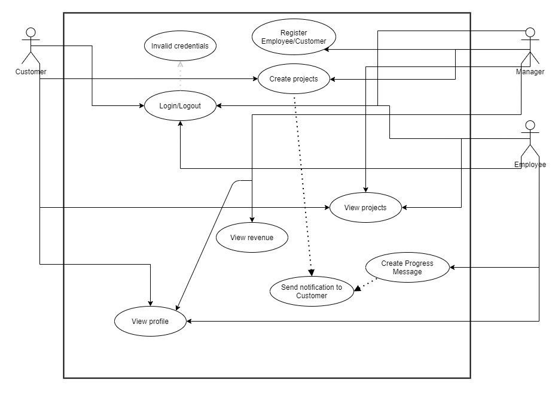
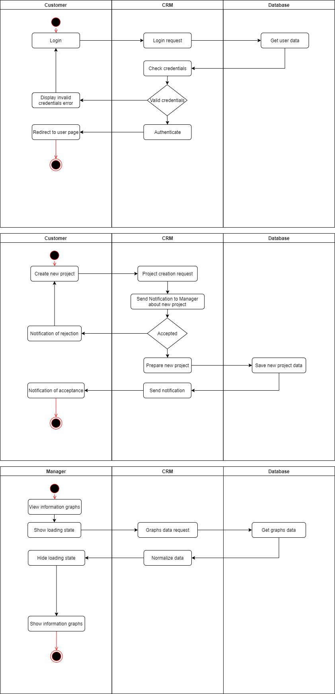
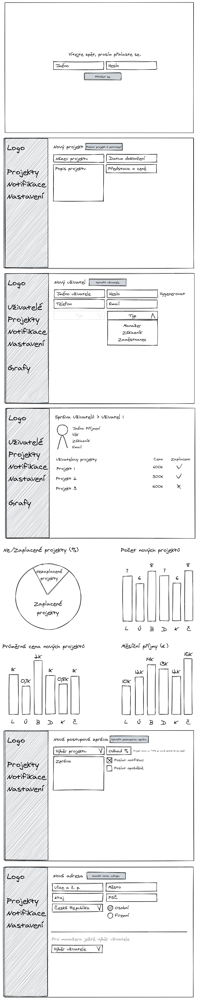
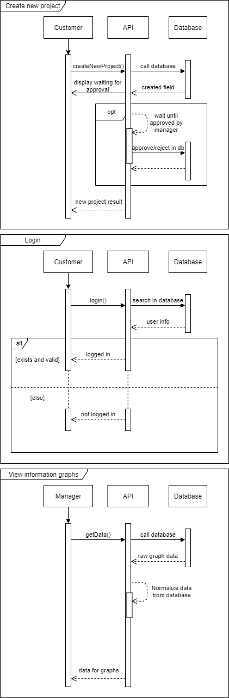
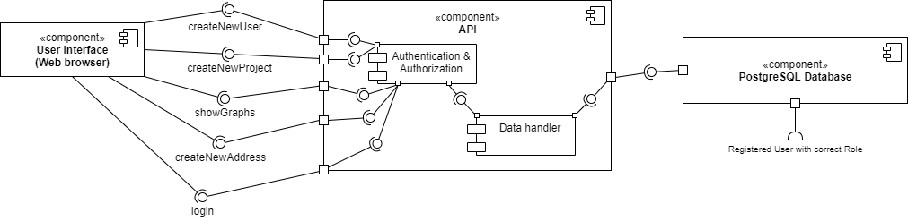
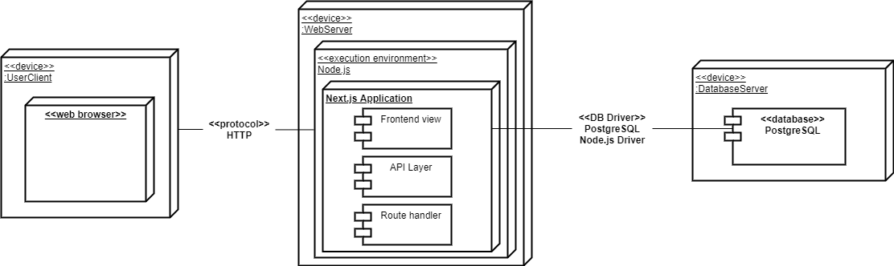

# CRM for Digital Agency

> Author: Ondřej Kocián, KOC0280

## Why

Bunch of tech people started new Digital Agency and they need CRM for keeping eye on their customers and projects.
They could make their system but everyone in the agency is already too busy because of constantly incoming new customers with projects.

## What

- Frontend (For easy communication with our API)
  - Web application
  - Desktop application
- Backend
  - Database layer for persisting data
  - REST API for Frontend applications and custom employee integrations
- Features
  - Project management
  - Customer management
  - Previews
    - Graphs for revenue
    - Customer can preview project progress
    - An employee can preview project info

## Who

1. Owner/Manager - Owners or Managers of the Digital Agency
2. Employee - Employees that have any projects
3. Customer - Customer who has a project

## Where

1. Web application
2. Console application
3. REST API

#### Frontend applications will use REST API for communication.

## When

1. Receiving new project (Adding project into our application)
2. Customer previewing progress
3. Employee previewing project deadline, info...
4. Managers/Owners previewing revenue data

## How

The system will be implemented using the Waterfall development model.

The code will be version controlled with Git on GitHub.

# Scenarios

## Use Case Model

### Přihlášení uživatele

- Aktéři: Uživatel (Manažer, Zaměstnanec, Zákazník)
- Vstupní podmínky: Registrovaný uživatel
- Spouštěč: Žádost o přihlášení
- Úspěšný scénář:
  1. Uživatel zadá jméno a heslo
  2. Nalezení uživatele v databázi podle zadaných údajů
  3. Kontrola hesla proběhla úspěšně
  4. Nastavení auth cookie
  5. Přesun uživatele na zabezpečenou stránku
- Neúspěšný/Alternativní scénář:

  1. Uživatel zadá jméno a heslo
  2. Nalezení uživatele v databázi podle zadaných údajů
  3. Kontrola hesla proběhla neúspěšně
  4. Výpis chyby (Špatné heslo)
  5. Opakování dokud se nezadá správné heslo
  6. Kontrola hesla proběhla úspěšně
  7. Nastavení auth cookie
  8. Přesun uživatele na zabezpečenou stránku

### Vytvoření nového projektu

- Aktéři: Uživatel (Manažer, Zaměstnanec, Zákazník)
- Vstupní podmínky: Přihlášený uživatel, Nový projekt
- Spouštěč: Žádost o vytvoření nového projektu
- Úspěšný scénář:
  1. Přihlášený uživatel přejde na stránku pro vytváření nových projektů
  2. Uživatel zadá potřebné údaje o projektu
  3. Uživatel potvrdí údaje a odešle dotaz na vytvoření nového projektu
  4. Manažer později Příjme nebo Odmítne tento projekt
  5. Uživateli příjde notifikace/zpráva na webu, že jeho projekt byl příjmut nebo odmítnut
  6. Projekt se pak předá dál k zaměstnancům a začne se na něm pracovat

### Přehled informačních grafů

- Aktéři: Manažer
- Vstupní podmínky: Přihlášený uživatel s rolí Manažera
- Spouštěč: Přesun na stránku pro zobrazení grafů
- Úspěšný scénář:
  1. Přihlášený manažer přejde na stránku s grafy
  2. Stránka zobrazí ikonku načítání a pošle požadavek do API pro grafy
  3. Z API se pošle dotaz na databázi, která vrátí data určené pro grafy
  4. Do grafů se načtou data z databáze
  5. Ikonka načítání zmizí
  6. Zobrazí se grafy

## Activity Diagram

# Conceptual Domain Model

1. Velikosti entit a množství
   1. Tabulka s uživateli bude mít max 600kB na záznam a maximálně 10000 záznamů
   2. Tabulka s adresami bude mít max 500kB na záznam a maximálně 20000 záznamů
   3. Tabulka s projekty bude mít max 600kB na záznam a maximálně 15000 záznamů
   4. Tabulka s fakturami bude mít max 400kB na záznam a maximálně 30000 záznamů
   5. Tabulka s webovýma stránkama bude mít max 450kB na záznam a maximálně 30000 záznamů
2. Odhad počtu uživatelů současně pracujících se systémem
   - Maximálně 100 současně pracujících uživatelů systému zároveň
3. Typy interakcí uživatelů se systémem a odhad jejich náročnosti
   1. Zobrazení grafů pro manažery
      - Poměrně náročné na servery při normalizaci dat z databáze
   2. Zobrazení projektů
      - Nemělo by být náročné při malém počtu projektů
   3. Notifikace
   4. Tvorba nových projektů a uživatelů
      - Nenáročný input/output
   5. Tvorba postupových zpráv projektů
      - Nenáročný input/output
4. První představa o rozložení systému a volba platforem
   1. Platformy
      1. Web
      2. Console pro API manipulaci
   1. Technologie
      1. React (Next.js => Static generation)
      2. TypeScript
      3. Node.js (Next.js API routes)
      4. PostgreSQL

# Wireframes

# Domain Model

## Class Diagram

## Sequence Diagram

## Design Patterns

1. K manipulaci s databází bude použit **ActiveRecord**
2. Některé třídy (např. Připojení k databázi jako třída) budou použity jako **Singletony**
3. Template method
4. Iterator

# Architecture

## Component Diagram

## Deployment Diagram

